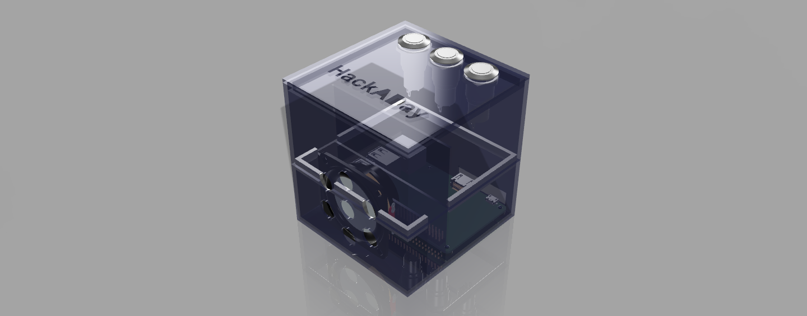

#DIY Google AIY

This is an alternative to the Google AIY kit that was distributed with the May2017 issue of MagPi. The complete write-up of the project is available on Hackaday where I posted a teardown as well as instruction on how to get one of your own up and running.

Please free to fork and submit a pull request.

##STLs
For this project I have provided some STL files that can be downloaded and 3D printed. Here is a preview of what to expect.

The above was rendered with Autodesk Fusion 360 

##TODO
* Layout needs to be done and then tested.
* Prototype Testing
* Microphone Board needs to laid out

##Author and License

Designed by [Inderpreet Singh](https://inderpreet.github.io)
[Embedded Code Blog](https://embeddedcode.wordpress.com)

This software may be distributed and modified under the terms of the GNU
General Public License version 2 (GPL2) as published by the Free Software
Foundation and appearing in the file LICENSE.TXT included in the packaging of
this file. Please note that GPL2 Section 2[b] requires that all works based
on this software must also be made publicly available under the terms of
the GPL2 ("Copyleft").

We put a lot of time and effort into our project and hence this copyright 
notice ensures that people contribute as well as each contribution is 
acknowledged. Please retain this original notice and if you make changes
please document them below along with your details.

The latest copy of this project/library can be found at: 
https://github.com/inderpreet/
